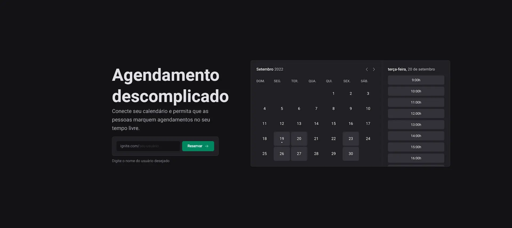
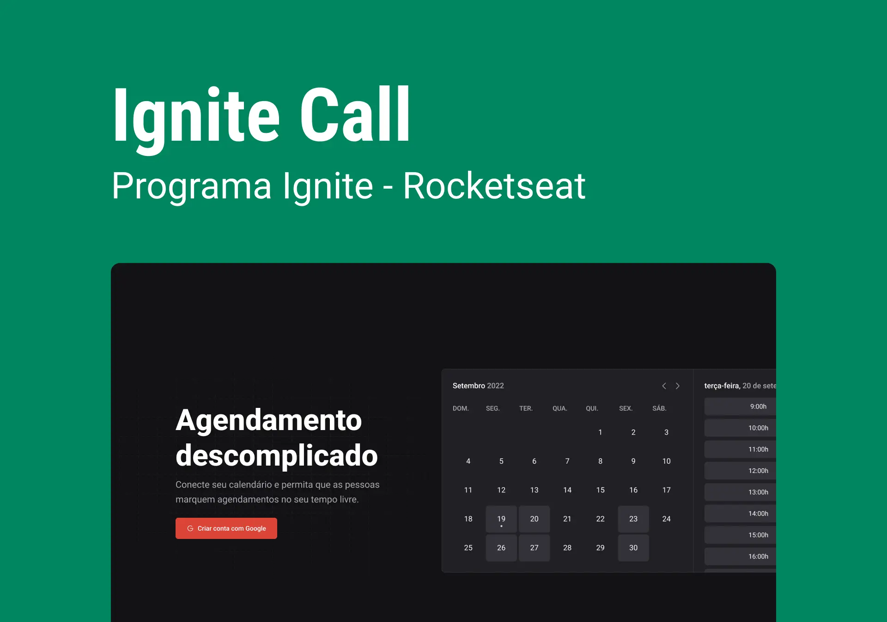

<!-- ===== HEADER ===== -->
<p align="right">
  
  <a href="./README.pt-br.md" title="Ler o README em português brasileiro">
    
  </a>
</p>

<h1 align="center">
  <a
    href="https://guipmdev-ignite-call.vercel.app/"
    title="Go to the web application"
    >Ignite Call</a
  >
</h1>

<p align="center">
  
  
  
  <a
    href="https://github.com/guipmdev/ignite-call/commits/main"
    title="View repository commits"
  >
    
  </a>
  <a href="./LICENSE" title="View project license">
    
  </a>
  <a href="https://www.rocketseat.com.br/" title="Go to the Rocketseat website">
    
  </a>
</p>



<p align="center">
  <a href="https://guipmdev-ignite-call.vercel.app/"
    >Go to the web application ↗</a
  >
</p>

<details>
  <summary>
    <h2>📒 Table of Contents</h2>
  </summary>

- [📍 Overview](#-overview)
- [✨ Features](#-features)
- [🤖 Demo](#-demo)
- [🎨 Layout](#-layout)
- [🛠 Technologies](#-technologies)
  - [Website](#website)
  - [Back-end](#back-end)
  - [Utils](#utils)
- [🚀 Getting Started](#-getting-started)
  - [✔️ Prerequisites](#️-prerequisites)
  - [📦 Installation](#-installation)
  - [⚙️ Usage](#️-usage)
- [📄 License](#-license)
- [👏 Acknowledgments](#-acknowledgments)
</details>

<!-- ===== PROJECT INFOS ===== -->

## 📍 Overview

This project is a scheduling web application developed in _Next.js_ and _TypeScript_ that allows users to create and manage their schedules. It offers features such as user registration, profile management, connection to Google Calendar and creation of scheduling events.

The application aims to simplify the agenda management process and ensure that users have an efficient and organized way of managing their time. Its value proposition lies in its seamless integration with Google Calendar, its user-friendly interface and its robust scheduling and availability management functionality.

## ✨ Features

🏷 **Reserve your username** for later

📅 Seamlessly sync your agenda with **Google Calendar integration**

👥 Personalize your experience with easy **user registration and profile management**

➕ **Create scheduling events without conflicts** and add them into your Google Calendar

🔗 **Share your link** and watch events pops right into your agenda.

## 🤖 Demo

## 🎨 Layout

The layout of the application was designed by **Rocketseat** and is available on [Figma](<https://www.figma.com/file/5NSfvvfsVxKatf19vsoshN/Ignite-Call-(Community)>).

<p align="center">
  
</p>

## 🛠 Technologies

The following tools were used to build the project:

### Website

<p>
  <a href="https://nextjs.org/">
    
  </a>
  <a href="https://www.typescriptlang.org/">
    
  </a>
  <a href="https://eslint.org/">
    
  </a>
  <a href="https://github.com/rocketseat/eslint-config-rocketseat">
    
  </a>
</p>

<p>
  <a href="https://axios-http.com/">
    
  </a>
  <a href="https://react-hook-form.com/">
    
  </a>
  <a href="https://github.com/colinhacks/zod">
    
  </a>
  <a href="https://next-auth.js.org/">
    
  </a>
  <a href="https://day.js.org/">
    
  </a>
  <a href="https://github.com/garmeeh/next-seo">
    
  </a>
</p>

<p>
  <a href="https://phosphoricons.com/">
    
  </a>
</p>

### Back-end

<p>
  <a href="https://www.prisma.io/">
    
  </a>
  <a href="https://tanstack.com/query/">
    
  </a>
  <a href="https://github.com/googleapis/google-api-nodejs-client">
    
  </a>
  <a href="https://github.com/maticzav/nookies">
    
  </a>
</p>

_\* See the [<kbd>package.json</kbd>](./package.json) file_

### Utils

<p>
  <a href="https://git-scm.com/">
    
  </a>
  <a href="https://nodejs.org/">
    
  </a>
  <a href="https://figma.com/">
    
  </a>
  <a href="https://fonts.google.com/">
    
  </a>
  <a href="https://code.visualstudio.com/">
    
  </a>
  <a href="https://www.docker.com/">
    
  </a>
</p>

<p>
  <a href="https://planetscale.com/">
    
  </a>
  <a href="https://vercel.com/">
    
  </a>
</p>

## 🚀 Getting Started

### ✔️ Prerequisites

Before you begin, ensure that you have the following tools installed on your machine: [Git](https://git-scm.com/downloads), [Node.js](https://nodejs.org/en/download). It's also good to have an editor to work with the code, such as [VSCode](https://code.visualstudio.com/Download).

### 📦 Installation

1. Clone the repository:

```sh
git clone https://github.com/guipmdev/ignite-call/
```

2. Change to the project directory:

```sh
cd ignite-call
```

3. Install the dependencies:

```sh
npm install
```

### ⚙️ Usage

1. Create a SQL database and note down the connection details

   - This can be a local database, a remote database, or even a [Docker](https://www.docker.com/) container

2. Visit [Google Cloud Console](https://console.cloud.google.com/apis/dashboard), create a project, enable Google Calendar API, and, under Credentials, create an OAuth 2.0 client ID, configure the consent screen, and get Client ID and Secret

3. Generate a secure secret key for NextAuth.js

   - If you’re on a UNIX system, you can use the command `openssl rand -base64 32` to generate this key

4. Rename the file `.env.example` to `.env` and insert the necessary information:

```sh
mv .env.example .env
```

5. Generate the migrations, if necessary:

```sh
npx prisma migrate dev
```

6. Push the migrations to the database:

```sh
npx prisma db push
```

7. Start the web application:

```sh
npm run dev
```

8. Access http://localhost:3000/ to view the application

## 📄 License

This project is licensed under the terms of the `MIT` license. See the
[LICENSE](./LICENSE) file for additional info.

## 👏 Acknowledgments

> - Many thanks to [Rocketseat](https://www.rocketseat.com.br/) for the layout and tips when putting this project together

<!-- ===== FOOTER ===== -->

---

<p align="center">
  Made with 💙 by
  <a href="https://www.guipm.dev/"> @guipm.dev </a>
  - Feel free to
  <a href="mailto:guipm.dev@gmail.com">contact me</a>!
</p>

<br />

<p align="center">
  <a href="#top">
    <b>↑&nbsp;&nbsp; Return to the top &nbsp;&nbsp;↑</b>
  </a>
</p>
